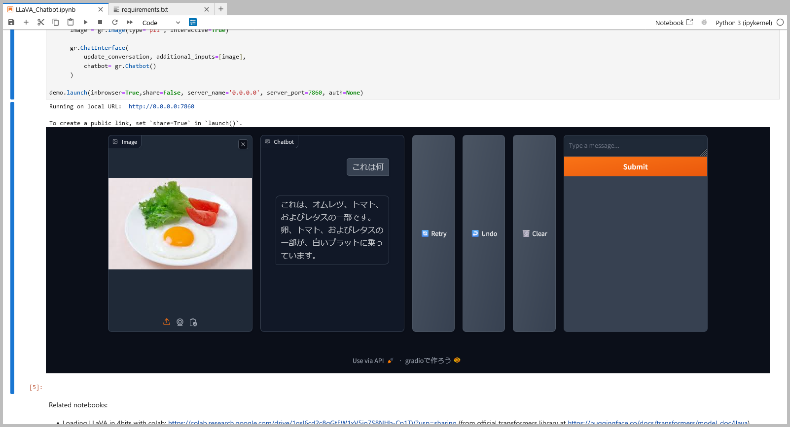

# LLaVA-v1.5-7b Docker Setup

このプロジェクトは、llava-v1.5-7bモデルをJupyterLabを利用して実行するためのDockerコンテナ設定を提供します。コンテナを使用することで、Jupyter Notebookインターフェースを通じてモデルと対話したり、SSHでリモート管理を行うことができます。

## セットアップ

### Dockerイメージのビルド

```bash
docker-compose up build
```

### JupyterLabの起動

コンテナの起動後、JupyterLabが自動的に起動するのでWebブラウザを開いて次のURLにアクセスします。
<http://localhost:8888>

## コンテナへのSSH接続

コンテナにSSHで接続するには、以下のコマンドを使用します。

```bash
ssh root@<ホストPCのIPアドレス> -p 2222
```

- ユーザー名: root

- パスワード: root (デフォルト、必要に応じて変更してください)
  
接続が完了したら、次のURLにアクセスします。
<http://ホストPCのIPアドレス:8888>
  
## 使用方法

### AIモデルの実行

llava-v1.5-7b モデルはJupyterLab内で使用できるように設定されています。モデルと対話するには、以下の手順に従います。

- JupyterLabを開き、添付されているipynbファイルをアップロードします。
- すべてのセルを実行し、モデルのロードが完了したら、必要に応じて画像やテキストを処理します。

実行例

